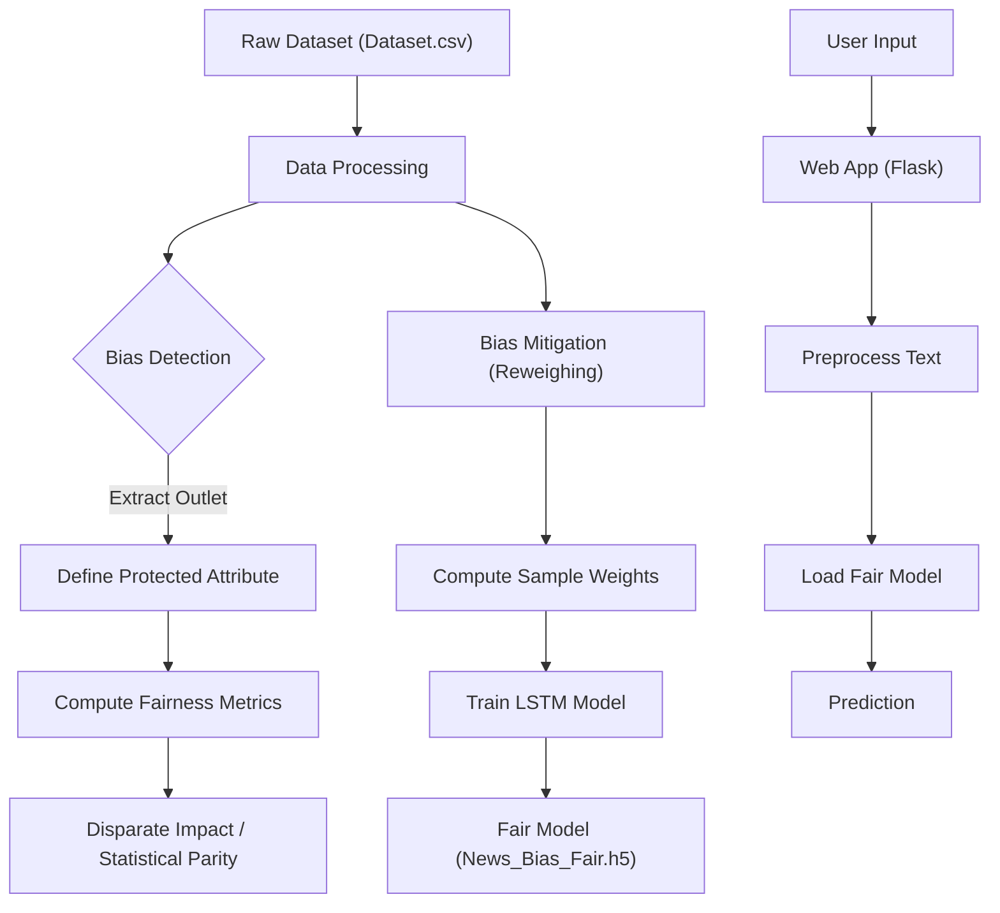

# Project Link :-> [https://news-bias-production.up.railway.app](https://detect-news-bias.up.railway.app/)

# News Bias Detection with IBM AIF360

This project implements a News Bias Detection system using a Deep Learning model (LSTM) and integrates **IBM AIF360** to detect and mitigate algorithmic bias.

## Overview

The application analyzes news articles to determine if they are biased or non-biased. It uses a dataset of labeled news articles and employs Natural Language Processing (NLP) techniques for feature extraction. To ensure fairness, we use IBM's AI Fairness 360 (AIF360) toolkit to detect bias against specific news outlets and mitigate it using the **Reweighing** algorithm.

## Features

-   **Bias Prediction**: Classifies news text as "Biased" or "Non-Biased".
-   **Fairness Integration**: Uses AIF360 to ensure the model is fair across different news sources.
-   **Web Interface**: A simple Flask-based web app for easy interaction.

## Architecture

### Bias Detection & Mitigation Workflow



## Installation

1.  **Clone the repository**:

    ```bash
    git clone https://github.com/SanketBaviskar/news-bias.git
    cd news-bias
    ```

2.  **Install Dependencies**:
    ```bash
    pip install tensorflow pandas numpy scikit-learn flask nltk aif360
    ```
    _Note: You might need to install `aif360[Reductions]` or `aif360[inFairness]` depending on specific algorithms, but for Reweighing, the base package is sufficient._

## Usage

### 1. Train the Fair Model

To retrain the model with bias mitigation:

```bash
python train_fair_model.py
```

This script will:
python bias_detection.py

```

### 3. User Guide

Once the application is deployed (e.g., on Railway), users can access it via the provided public URL.

1.  **Open the App**: Navigate to the URL (e.g., `https://news-bias-production.up.railway.app/`).
2.  **Input News**: Copy and paste the text of a news article into the text area.
3.  **Check Bias**: Click the **"Check Bias"** button.
4.  **View Result**: The application will display whether the news is **Biased** or **Not Biased** based on the analysis.

## Technical Details

### AIF360 Integration

-   **Protected Attribute**: `outlet` (News Source). We extract the domain from the Google News URLs in the dataset. The most frequent outlet is treated as the "privileged" group for demonstration purposes.
-   **Mitigation Algorithm**: **Reweighing**. This is a pre-processing technique that weights the examples in each (group, label) combination differently to ensure fairness before classification.
-   **Model**: A Bidirectional LSTM (or standard LSTM) trained on One-Hot encoded text sequences.

## File Structure

-   `app.py`: Flask application entry point.
-   `bias_detection.py`: Script to compute fairness metrics.
-   `train_fair_model.py`: Script to train the model with AIF360 weights.
-   `Dataset.csv`: The dataset used for training.
-   `News_Bias_Fair.h5`: The trained fair model.
```
